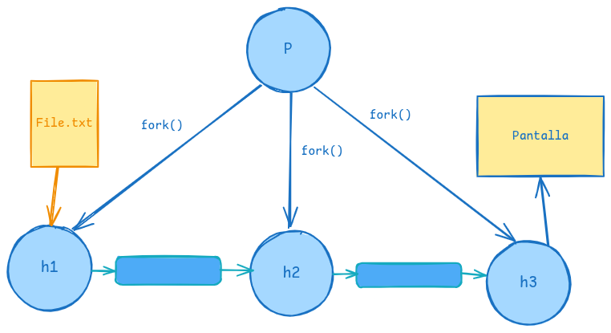

# Ejercicio de Pipes 1

Realizar el código en c que cree el siguiente arbol de procesos y utilice el medio de comunicación pipes para que el primer hijo Lea un archivo file.txt y el ultimo hijo imprima el contenido como se ilustra a continuación:

