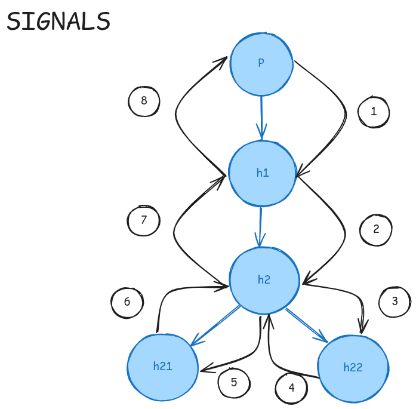

# Ejercicio de Señales 1

Realzar el código en c que cree el siguiente arbol de procesos y relice las señales que se ilustran a continuación



Salida esperada:

```sh
soy el padre, pid(14817)
Soy el hijo 1, pid(14818)
Soy el hijo 2, pid(14820)
Soy el hijo 22, pid(0)
Soy el hijo 2, pid(14820)
Soy el hijo 21, pid(0)
Soy el hijo 2, pid(14820)
Soy el hijo 1, pid(14818)
Soy el padre, pid(14817)
```
